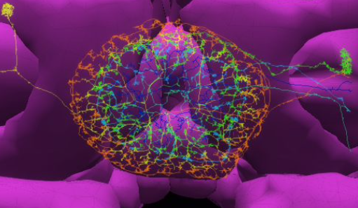
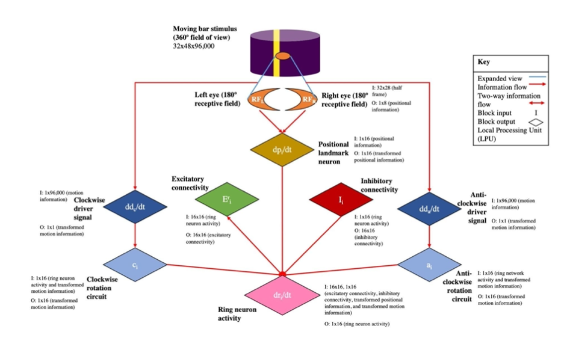
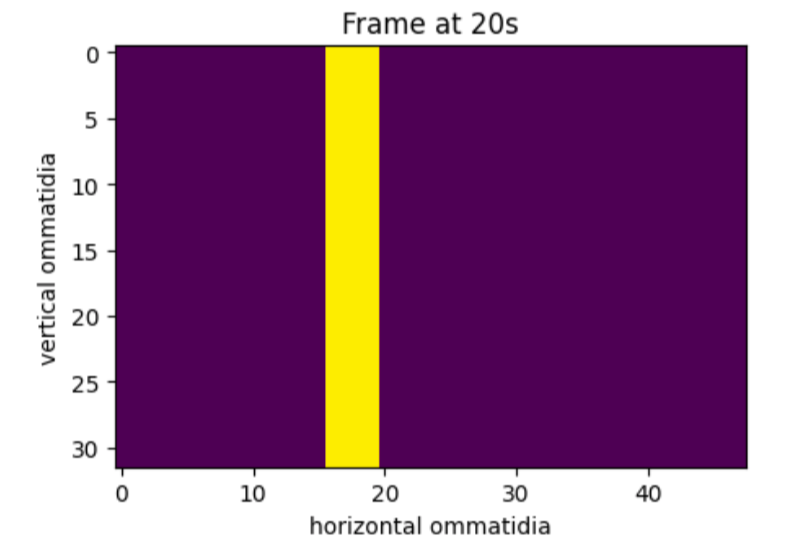
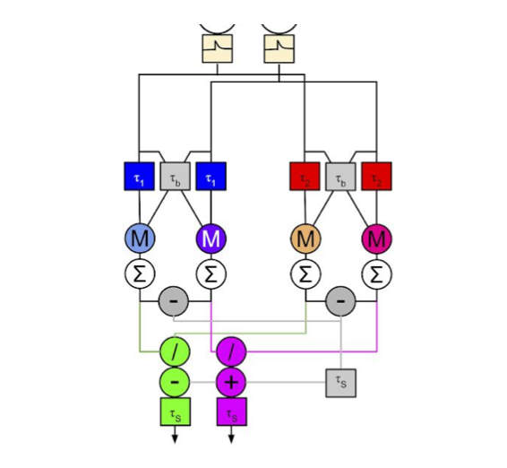
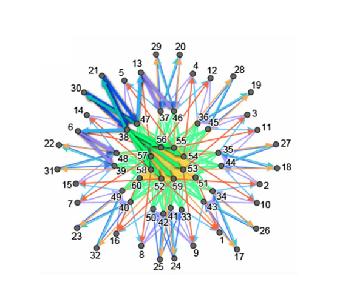
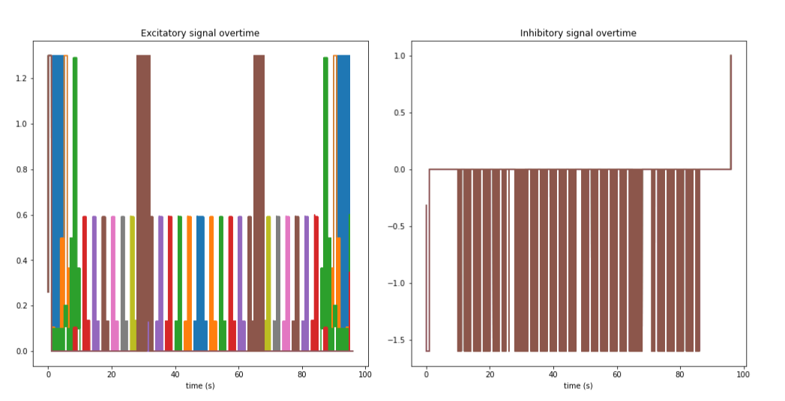
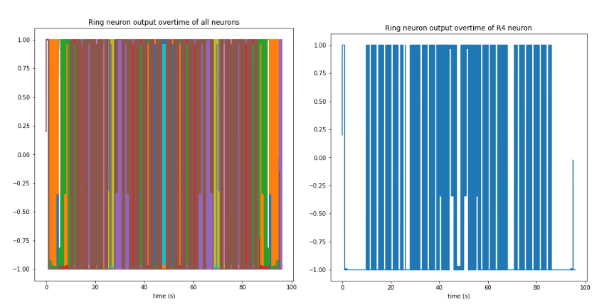
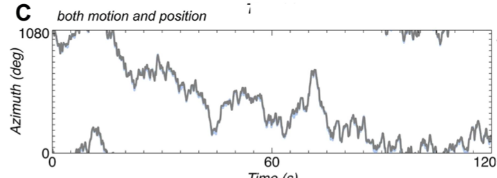

# drosophila-central-complex
A course project, this script is a computational model of the Drosophila Melanogaster visual system (central complex, CX). The aim of this script is to replicate the results of Experiment 1 of [Cope et al. (2017)](https://journals.plos.org/plosone/article?id=10.1371/journal.pone.0172325#authcontrib)
 * 
 *  

## Requirements
- GPU access (Google Colab and Kaggle are good starting points for free GPU access)

## Pipeline
#### 0. Initialize the process by running all cells in drosophila_cx.ipynb

#### 1. Construct CX Model:
  * Generate moving bar stimulus
  *  
  * Build AVDU Motion Detector
  * 
  * Build Ring Attractor Network 
  *  
    
#### 2. Test CX Model by Replicating Experiment 1 of Cope et al. (2017)
  * Initialize outputs
  * Run helper functions and main r(t) function

#### 3. Plot computation results (over time)
  * Clockwise driver signal 
  * Anticlockwise driver signal 
  * Receptive field 
  * Positional input
  * Excitatory connectivity
  * Inhibitory connectivity
  *   
  * Ring neuron output (motion+position)
  * Ring neuron output (position only)
  * Ring neuron output (motion only)

#### 4. Update model with connectivity weights from [NeuroNLP](https://hemibrain12.neuronlp.fruitflybrain.org/) (EXPERIMENTAL)
  * Manually import connectivities 
  * Build function for mapping connectivity weights to variable weights

#### 5. Re-run CX Model with updated connectivity weights
  *  

#### 6. Plot computational results with updated connectivity weights (repeat 3.)

## Output:
  * Time limitations of the course project precluded us from creating results that matched that of Cope et al. to a satisfying level. However, the changes in response shown in our stimulus response show promise for further fine tuning for more accurate representations of the CX model.
  *  
  *  

## Acknowledgements
* Bionet Group, Electrical Engineering Department, School of Engineering and Applied Science, Columbia University, New York, NY
